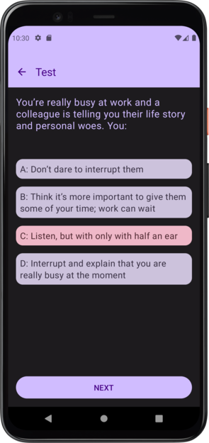
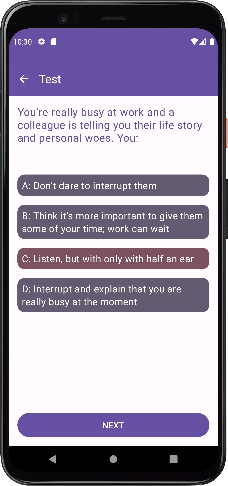

TestDemo App
==================

This android project has small quiz. Contains questions with few options. At the end it displays selected options as result.
  
This project..
  
* Follows modern android application development(MAD).
* Kotlin is used as primary coding language.
* Jetpack Compose is used for user interface(UI).
* Follows MVVM with clean architecture pattern for scalable and maintainable code.
* Room library for database.
* Retrofit library for network calls.
* Dagger Hilt library for dependency injection.
* Use of Coroutines for background work like network calls.
* Use of Single activity architecture.
* Data Layer - Repositories, Local and remote data sources
* Domain Layer - Use cases with business logic
* Presentation Layer - Activity, Composable functions and ViewModels
  
This project can be use as starter template to create new android application.  
In future, I will add UI and unit testcases.  
Bugs, suggestions and improvements are welcome.

<table>
  <tr>
    <td> 
        
    </td>
    <td>
        
    </td>
  </tr>
</table>

